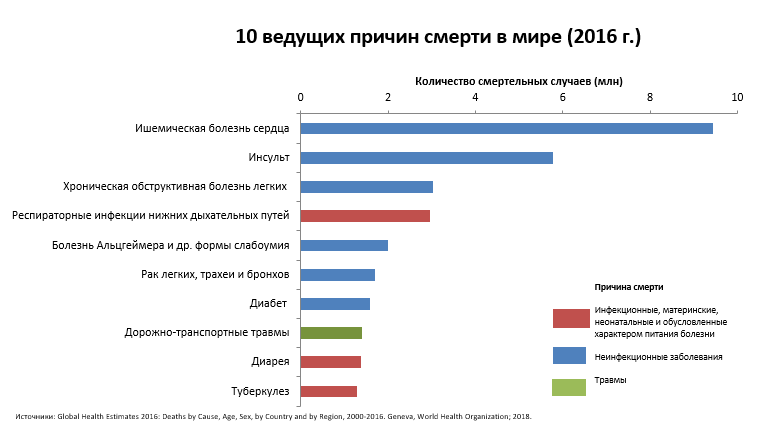
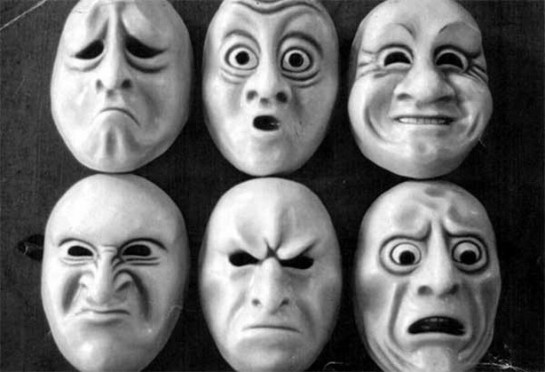
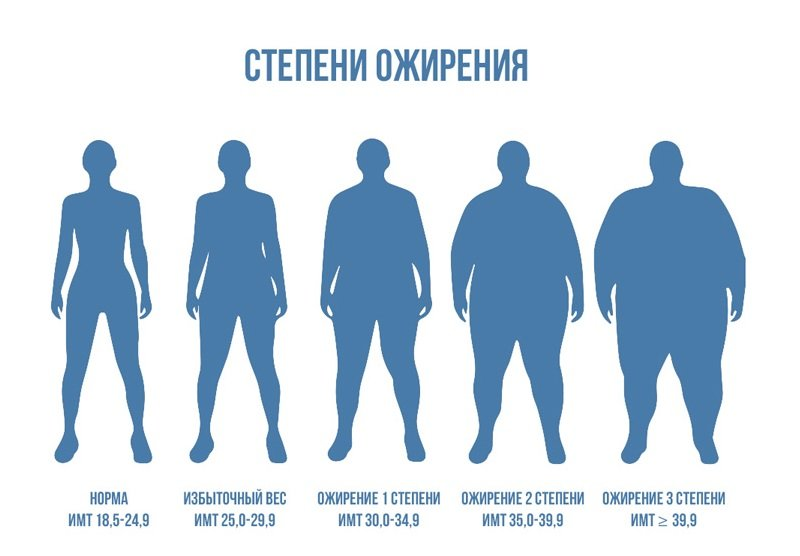
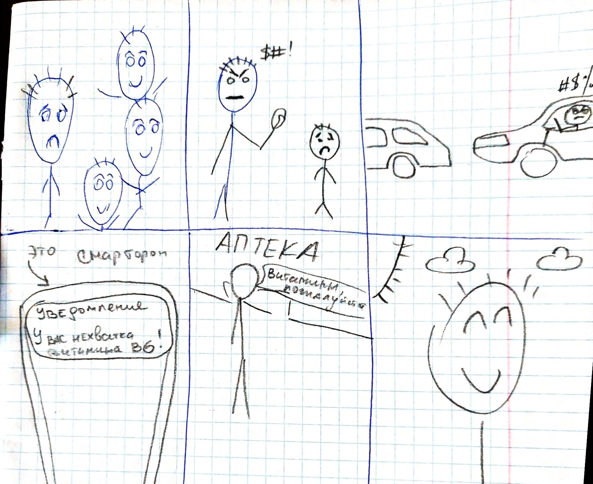
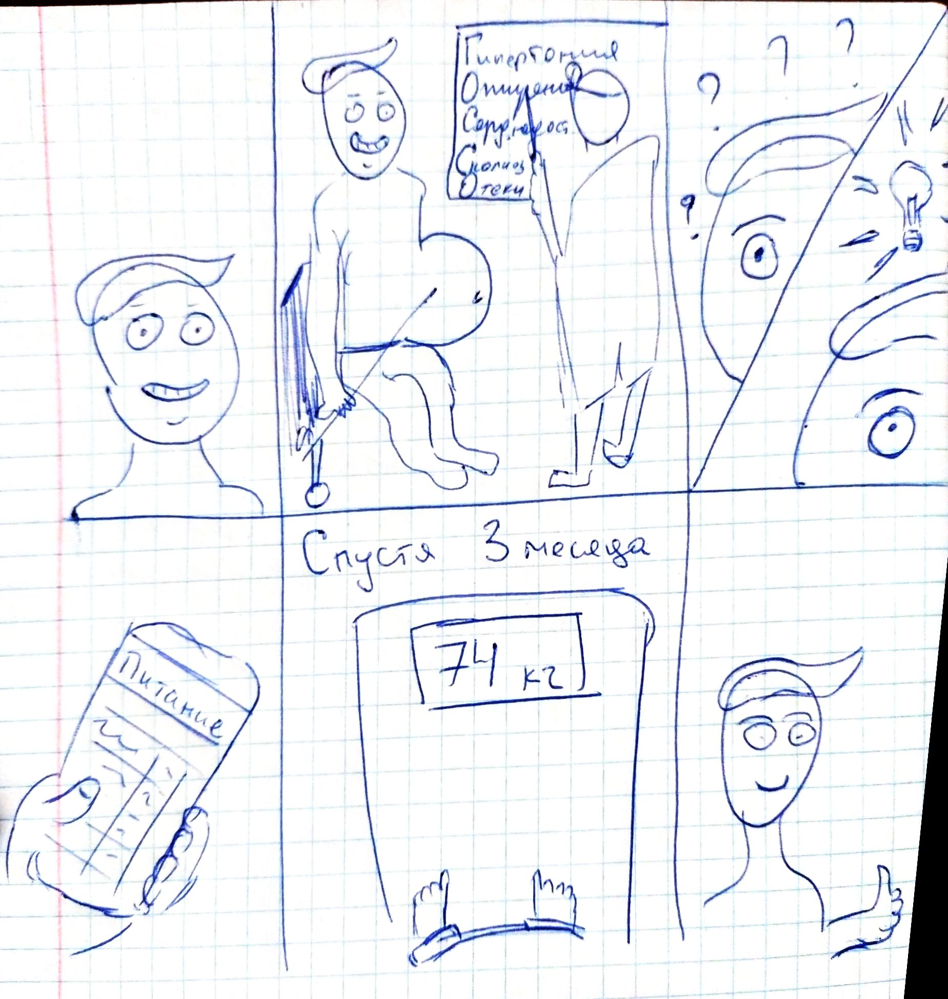

# Работу выполнил Кацков Павел ИПБ-16

# Точка зрения

Контроль питания - очень важный процесс, от которого зависит настроение, здоровье и самочувствие людей; он должен быть простым и удобным для учета каждый день

# Доска вдохновения

# Вдохновения

## 1. Смертность
Первые места в строчках рейтинга занимают именно те болезни. которые можно корректировать изменением своего питания и образа жизни. Это первая и самая важная причина. Изменив питание, повышается общее качество жизни. 

## 2. Плохие эмоции
Агрессия, депрессия, лень. Настроение людей напрямую зависит от качества питания, только таким образом нервная система будет способна вполную силу защищать на от негатива. 

## 3. Ожирение
Ожирение мало того что является проблемой со здоровьем, и способно вызывать множество вторичных болезней, является неэстетичным. Опять же снижается качетво жизни. 

## 4. Инфраструктура и сервисы
В наше время есть абсолютно вся инфраструктура чтобы начать контролировать свое питание. Интернет, телефоны, продукты, планы питания, диетологи и еще много другого.

## 5. Здоровое будущее
Множество плохих решение принимается под плохими эмоциями. В мире огроменнейшее количество больных людей, а значит и качество жизни их плохое. Плохое качество жизни - низкая трудоспособность. Низкая трудоспособность - мало работы. Мало работы - мало достижений. Только повысив качество жизни людей, человечество способно прийти в светлое и здоровое будущее. 

# Раскадровки

1. Гриша пришел на встречу с друзьями, но почему-то грустит. Сам не понимает почему. От этого ему еще более грустно. Встреча с друзьями не удалать, поэтому Гриша пошел домой, где накричал на своего ребенка, из-за простого вопроса. Потом гриша поехал на работу и все время ворчал на других водителей. Но Гриша уже как два месяца пытается контролировать свое питание. Оказалось, что  у Гришы просто был недостаток витамина B6, из-за того что он плохо кушал. Гриша сразу же  сходил в аптеку и купил витамины, после чего все наладилось.

2. Егор улыбается. Но не потому что ему весело или у него хорошее настроение, а потому что это защитная реакция организма на то, что ему сказал врач. Егор очень плохо кушал и получил ожирение, гипертонию, сердечную недостаточность, сколиоз и еще два десятка болезней. "Что делать мне?" - подумал егор. "Контроль питания! - ответил врач". Егор открыть приложение и составил план на 3 месяца с учетом своих вкусов. Результат не заставил себя ждать! Через 3 месяца Егор сильно сбросил вес, а у него понизилось давление, пропала усталось и отдышка. Общий список болезней сократился. Егор очень рад и советует!

